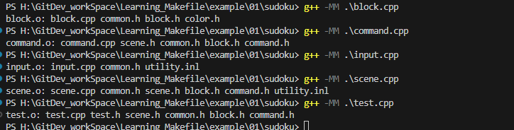

# GCC G++ 入门

## 用法
    gcc(g++) <options> <sourcefiles...>
    · 示例
    gcc main.cpp
    gcc -o main main.cpp
    gcc -o main main.cpp hello.cpp fun.cpp
    gcc -I../headers -o main main.cpp
    g++ -o main -I../headers -L../lib -lfun1 main.cpp hello.cpp

常用选项(options)

| 选项                  |                       作用   |    
|  ----  | ----  |
| -o <filename>            | 指定生成文件名          |                 
|-I<dir>	               | 指定头文件搜索路径       |
|-L<dir>	               | 指定库搜索路径          | 
|-static	               | 静态链接               | 
|-E -o<filename.i>	       | 编译过程进行到预处理    | 
|-S                        | 编译过程进行到编译      | 
|-c	                       | 编译过程进行到汇编      | 
|-O(0-3)	               | 指定代码优化级别        | 
|-Wall	                   | 输出警告信息            | 
|-fexec-charset=GBK	       | 指定运行时编码          | 
|-finput-charset=UTF-8	   | 指定源文件编码          | 
|-l<libname>	           | 指定链接库名            | 

### 静态链接库
#### 命名
    静态链接库命名采用lib<name>.a的形式，例如libmangle.a，libpng.a

#### 归档（静态链接库生成）
    先将需要归档到库的源文件编译成.o文件，再用下列命令归档
    ar rcs <libname> <objfilelist...>
    # 示例
    ar rcs libfun.a fun1.o fun2.o fun3.o # 将3个.o文件归档到同一库文件当中
#### 使用
    先将使用到对应静态库的源文件编译为.o文件，再进行链接
    gcc(g++) <ofilelist...> -L<dir> -l<lib>
    # 示例
    gcc main.o hello.o -L../lib -lfun1 -lfun2 -lfun3
    # 或者
    gcc main.o hello.o ../lib/libfun1.a ../lib/libfun2.a ../lib/libfun3.a
### 动态链接库

#### 命名
    动态链接库命名规则为lib<name>.dll (Windows) / lib<name>.so (Linux)，例如：libmangle.dll/libmangle.so，libpng.dll/libpng.so
#### 生成
    # 分步进行
    gcc(g++) -c -fPIC <sourcefilelist ...>
    gcc(g++) -o <libname> -shared <objfilelist ...>
    # 示例
    gcc -c -fPIC fun1.c fun2.c fun3.c
    gcc -o libfun.dll -shared fun1.o fun2.o fun3.o

    # 一步到位
    gcc(g++) -o <libname> -fPIC -shared <sourcefilelist ...>
    # 示例
    gcc -o libfun.dll -fPIC  -shared fun1.c fun2.c fun3.c
#### 使用
    先将使用到对应静态库的源文件编译为.o文件，再进行链接
    gcc(g++) <ofilelist...> -L<dir> -l<lib>
    # 示例
    gcc main.o hello.o -L../lib -lfun1 -lfun2 -lfun3
    # 或者
    gcc main.o hello.o ../lib/libfun1.dll ../lib/libfun2.dll ../lib/libfun3.dll

# Learning_Makefile

## Makefile文件内容组成
一个Makefile文件通常由五种类型的内容组成：显式规则、隐式规则、变量定义、指令和注释  
**显式规则(explicit rules)**：显式指明何时以及如何生成或更新目标文件，显式规则包括目标、依赖和更新方法三个部分  
**隐式规则(implicit rules)**：根据文件自动推导如何从依赖生成或更新目标文件。    
**变量定义(variable definitions)**：定议变量并指定值，值都是字符串，类似C语言中的宏定义(#define)，在使用时将值展开到引用位置    
**指令(directives)**：在make读取Makefile的过程中做一些特别的操作，包括：    
读取(包含)另一个makefile文件(类似C语言中的#include) 
确定是否使用或略过makefile文件中的一部分内容(类似C语言中的#if)  
**定义多行变量**    
**注释(comments)**：一行当中 # 后面的内容都是注释，不会被make执行。make当中只有单行注释。如果需要用到#而不是注释，用\#。

 例如：
 ``` Makefile
sudoku: block.o command.o input.o main.o scene.o test.o
    g++ -o sudoku block.o command.o input.o main.o scene.o test.o

block.o: block.cpp common.h block.h color.h
    g++ -c block.cpp

command.o: command.cpp scene.h common.h block.h command.h
    g++ -c command.cpp

input.o: input.cpp common.h utility.inl
    g++ -c input.cpp

main.o: main.cpp scene.h common.h block.h command.h input.h
    g++ -c main.cpp

scene.o: scene.cpp common.h scene.h block.h command.h utility.inl
    g++ -c scene.cpp

test.o: test.cpp test.h scene.h common.h block.h command.h
    g++ -c test.cpp

hello.o: hello.cpp
    g++ -c hello.cpp


clean:
    rm block.o command.o input.o main.o scene.o test.o
    rm sudoku.exe
 ```

 **让make去识别当前的依赖：g++ -MM xxx.cpp**    
 


 ## 目标：  

Makefile中会有很多目标，但最终目标只有一个，其他所有内容都是为这个最终目标服务的，写Makefile的时候先写出最终目标，再依次解决总目标的依赖    
**一般情况第一条规则中的目标会被确立为最终目标，第一条规则默认会被make执行**        
通常来说目标是一个文件，一条规则的目的就是生成或更新目标文件。  
make会根据目标文件和依赖文件最后修改时间判断是否需要执行更新目标文件的方法。如果目标文件不存在或者目标文件最后修改时间早于其中一个依赖文件最后修改时间，则重新执行更新目标文件的方法。否则不会执行。    
除了最终目标对应的更新方法默认会执行外，如果Makefile中一个目标不是其他目标的依赖，那么这个目标对应的规则不会自动执行。需要手动指定，方法为
```Makefile
make <target>  # 如 make clean , make hello.o
```
可以使用.DEFAULT_GOAL来修改默认最终目标
```makefile
.DEFAULT_GOAL = main
all: 
    @echo all

main:
    @echo main
```

### 伪目标  

如果一个标并不是一个文件，则这个目标就是伪目标。例如前面的clean目标。如果说在当前目录下有一个文件名称和这个目标名称冲突了，则这个目标就没法执行。这时候需要用到一个特殊的目标 .PHONY，将上面的clean目标改写如下     
```makefile
.PHONY: clean
clean:
    rm block.o command.o input.o main.o scene.o test.o
    rm sudoku.exe
```
**这样即使当前目录下存在与目标同名的文件，该目标也能正常执行。**    

**伪目标的其他应用方式**
如果一条规则的依赖文件没有改动，则不会执行对应的更新方法。如果需要每次不论有没有改动都执行某一目标的更新方法，可以把对应的目标添加到.PHONY的依赖中，例如下面这种方式，则每次执行make都会更新test.o，不管其依赖文件有没有改动 
```makefile
test.o: test.cpp test.h
        g++ -c test.cpp

.PHONY: clean test.o
```

## 依赖

**普通依赖**    
普通依赖有两个特点：
如果这一依赖是由其他规则生成的文件，那么执行到这一目标前会先执行生成依赖的那一规则
如果任何一个依赖文件修改时间比目标晚，那么就重新生成目标文件，前面说过的这种形式都是普通依赖    
**order-only依赖**
依赖文件不存在时，会执行对应的方法生成，但依赖文件更新并不会导致目标文件的更新  
如果目标文件已存在，order-only依赖中的文件即使修改时间比目标文件晚，目标文件也不会更新。    
**功能**
只有第一次构造targets时才会使用order-only-prerequisites，后面即使order-only-prerequisites发生改变，也不会重新构造targets，而只有normal-prerequisites中的文件发生改变时才重新构造targets。
定义方法如下：
```makefile
#  “ | ” 竖线前面的是普通依赖，后面的是order-only依赖
# normal-prerequisites部分可以为空
targets : normal-prerequisites | order-only-prerequisites
```

## 指定依赖搜索路径
make默认在Makefile文件所在的目录下查找依赖文件，如果找不到，就会报错。这时候就需要手动指定搜索路径，用VPATH变量或vpath指令。    
VPATH用法如下：
```makefile
# 多个目录之间冒号隔开，这时make会在VPATH指定的这些目录里面查找依赖文件。
VPATH = <dir1>:<dir2>:<dir3>...
# 例如
VPATH = include:src
```
**例子**
```makefile 
# 目录结构如下
tmp
├── include
│   └── test.h
├── makefile
└── src
    ├── main.cpp
    └── test.cpp
```

```makefile
# 第一版 Makefile 
main: main.o test.o 
	g++ -o main main.o test.o 

main.o: main.cpp test.h
	g++ -c main.cpp 

test.o: test.cpp test.h	
	g++ -c test.cpp

VPATH = include:src

# 执行 make 命令后报错：
g++ -c main.cpp 
g++: error: main.cpp: No such file or directory
g++: fatal error: no input files
compilation terminated.
Makefile:42: recipe for target 'main.o' failed
make: *** [main.o] Error 1

```
**仔细看上面那个 g++ -c main.cpp  命令，我都在 Makefile 文件里指定了搜寻路径为 "src:inc" 了，为什么会找不到 main.cpp 文件呢？main.cpp 文件不就是在 src/ 目录下么？**    
涉及到 VPATH 的概念理解了   
**VPATH 和 vpath 只是在 make 寻找文件的依赖关系时才有作用，而 g++ -c main.cpp 是你定义的规则所执行的命令，会原封不动地执行，该命令的意思是在当前文件夹下编译 main.cpp 文件，由于没有找到 main.cpp ，故出现上述错误。**

**使用 make -n 可以查看具体执行的命令：**
```makefile
g++ -c main.cpp 
g++ -c test.cpp
g++ -o main main.o test.o
```
```makefile
# 第2版
# 使用 "$<" 这个自动变量
VPATH = include:src

main: main.o test.o 
	g++ -o main $<

main.o: main.cpp test.h
	g++ -c $<

test.o: test.cpp test.h	
	g++ -c $<

VPATH = include:src

#  运行命令 make -n 输出以下
g++ -c src/main.cpp
g++ -c include/test.cpp
g++ -o main main.o


# 执行make指令之后 依然报错
# g++ -c src/main.cpp
# src/main.cpp:2:10: fatal error: test.h: No such file or directory
#     2 | #include "test.h"
#       |          ^~~~~~~~
# compilation terminated.
# Makefile:58: recipe for target 'main.o' failed
# make: *** [main.o] Error 1
```
**以上在执行make的时候依然会报错，没有test.h文件，这里可以理解为找不到头文件**
修改方法有两种，个人自行理解吧：
第一种：#include "test.h" update to --> #include "../include/test.h"    
第二种：就是在依赖中指定头文件路径，也就是 "-I" 选项
```makefile
# 第3版
# 使用 "$<" 这个自动变量
VPATH = include:src

main: main.o test.o 
	g++ -o main $<

main.o: main.cpp test.h
	g++ -c $< -I include

test.o: test.cpp test.h	
	g++ -c $< -I include

VPATH = include:src
# 执行 make -n
# g++ -c src/main.cpp -I include
# g++ -c src/test.cpp -I include
# g++ -o main main.o

# 执行 make
g++ -c src/main.cpp -I include
g++ -c src/test.cpp -I include
g++ -o main main.o

# 没有报错
```
**继续向前**


vpath指令用法：vpath比VPATH使用更灵活，可以指定某个类型的文件在哪个目录搜索。
```makefile
# vpath <pattern> <directories>

vpath %.h include  # .h文件在include目录下查找
vpath %.h include:headers  # .h文件在include或headers文件下查找

vpath % src   # 所有文件都在src下查找

vpath hello.cpp src  # hello.cpp文件在src查找
```


